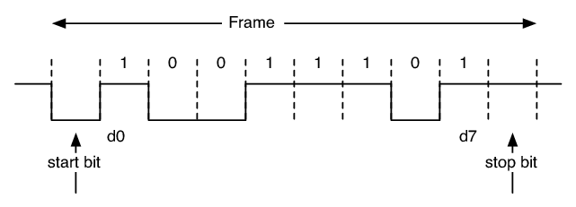

# VHDL projekt - UART

### Členové týmu

* Peter Pánisz (ja)
* Eduard Chyba
* Martin Borka

## Teoretický popis a vysvětlení

UART (z anglického Universal asynchronous receiver-transmitter) je sběrnice, která slouží k asynchronnímu sériovému přenosu dat. Skládá se ze dvou částí: Vysílač a přijímač.

Popis přenosu:

Vysílač kontinuálně vysílá hodnoty nastavené na páčkách. Na začátku přenosu je start bit reprezentován logickou 0, pak 8 datových bitů a nakonec stop bit reprezentován logickou 1. Zbývající odeslané byty jsou výplň reprezentována logickou 1. Tyto bity nejsou potřebné pro správnou funkčnost, ale my je odesíláme pro jednodušší ladění na osciloskopu.

  

## Hardware

V tomto projektu využíváme desku A7-50T od firmy Nexys. Tato deska nabízí mnoho možných vstupů a výstupů. V našem případě používáme přepínače a jedno tlačítko, pro nastavení zařízení.

V případu vysílače slouží 8 přepínačů v pravo (SW 0-7) pro nastavení 8 bitů které budeme odesílat přez port JA(0). Poté je tu ještě přepínač nalevo (SW 15) díky kterému mužeme nastavovat rychlost přenosu neboli baud rate. Poslední ovládací prvek je prostřední tlačítko, které zastává funkci reset (vyresetuje vnitřní program pokud by bylo potřeba).

Přijímač přímá na portu JD(0) přepínač nalevo (SW 15) a tlačítko reset zde zastávají stejnou funkci. U obou dvou programech se vysílaná či příjmaná 8 bitová zpráva ukázuje na osmi sedmi segmentových displejích.

## Software

### TX:

Data navolená na přepínačích jdou jak do driveru pro zobrazení na displeji tak to samotného vysílače tx, kde jsou pomocí clock_en a čítače postupně odesílány podle pravidel UART. Rychlost odesílání neboli rychlost čítače a clock_en jsou závislé na baud rate který můžeme měnit mezi 2 předem nastavenými hodnotami. Tok dat je z tx následně odeslán dále přes port.

  

  

### RX:

Data přijatá z portu se pomocí clock_en a čítače zapíší do vnitřního signálu který dále potuje to zobrazovací metody. Zprávné dekódování a zapsaní hodnot je závislé na baud rate který se může měnit mezi 2 předem nastavenými hodnotami.

  

## Ovládání
Naše UART jsou 2 ruzné programy: **RX** a **TX** (přijímač a vysílač).

### TX:

8 Přepínačů na pravo (SW 0-7): nastavování hodnot odesílaných bitů 8, které se zobrazí na displejích

Přepínač vlevo (SW 15): přepnutí mezi 9600 a 19200 BD

Prostřední tlačítko: reset

Zpráva se vysílá portem JA(0)

### RX:

Přijmací port je JD(0) a přijaté byty se zobrazí na displejích

Přepínač vlevo (SW 15): přepnutí mezi 9600 a 19200 BD

Prostřední tlačítko: reset

### Fotky a video při ovládání:
https://drive.google.com/drive/u/0/folders/1ZnK623iUQfYHucdSUApsKEXAbp9egKUu

## Reference

1. https://cs.wikipedia.org/wiki/UART
2. https://nandland.com/uart-serial-port-module/
